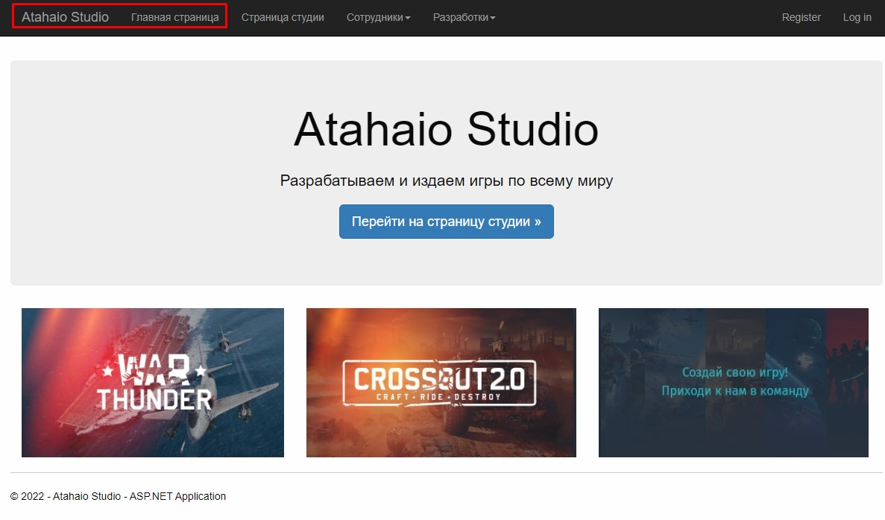
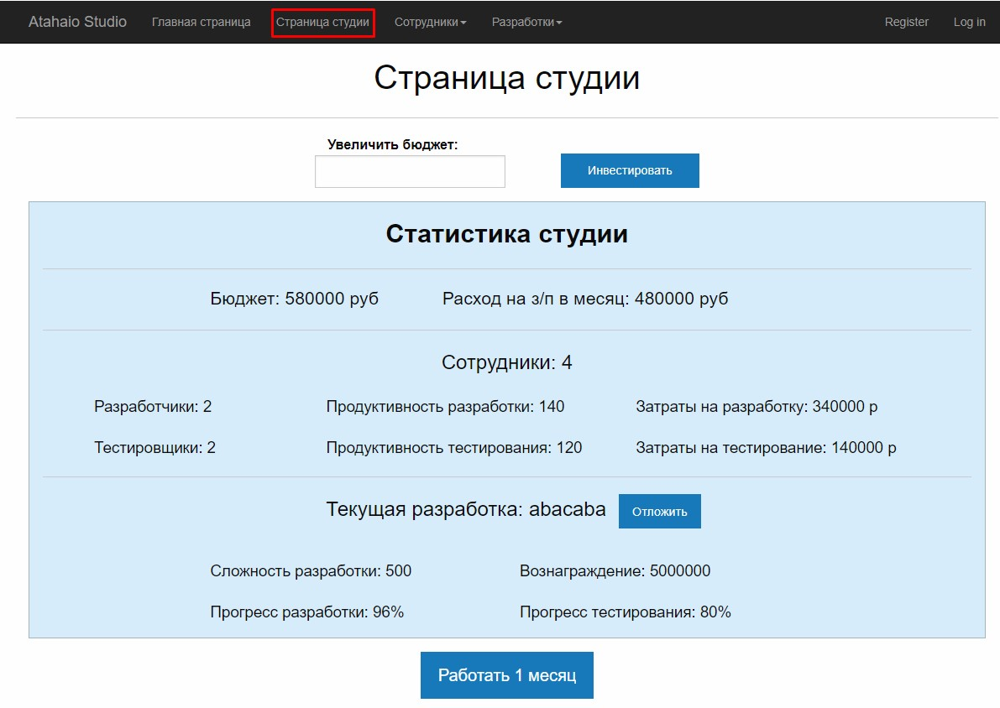
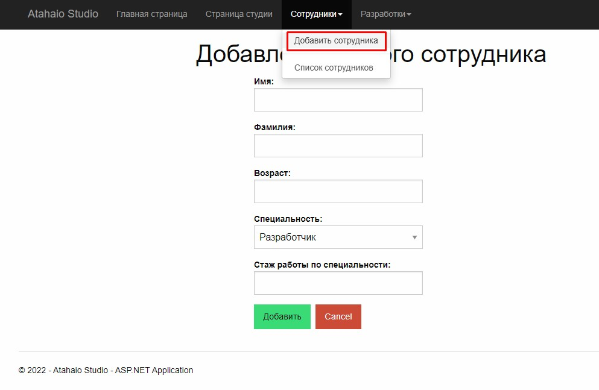
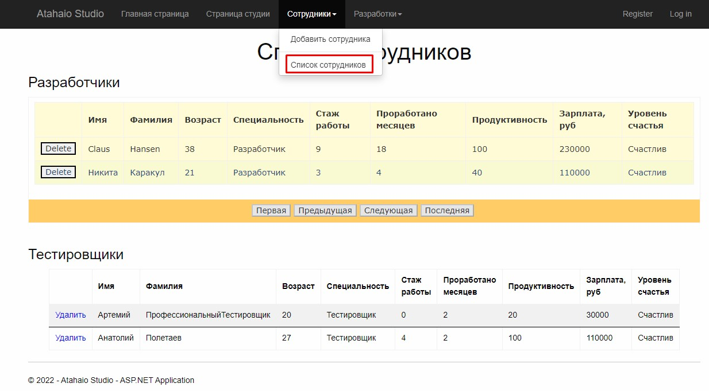
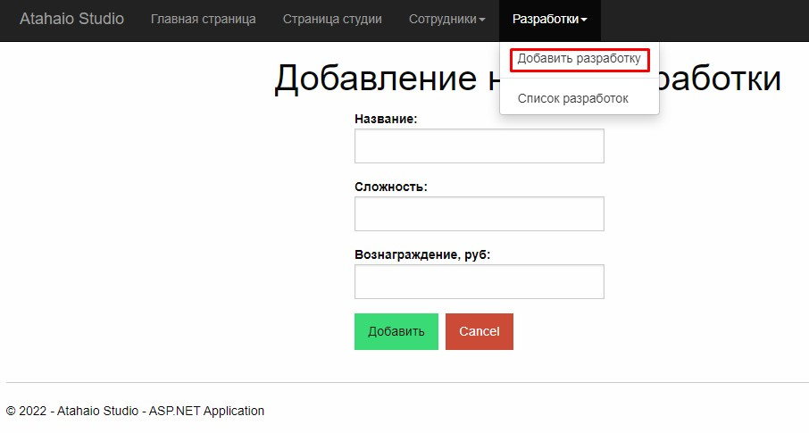
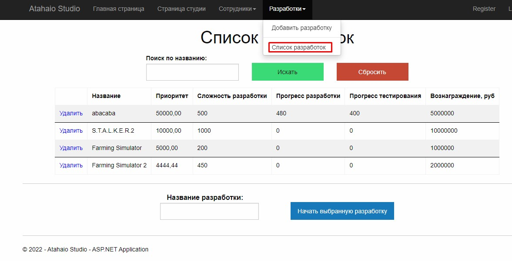

# Описание самостоятельного проекта по курсу "Программирование ASP.NET".  

##### Выполнил студент группы ИТ-32БО Майоров Александр.  

Если после запуска приложения не открывается главная страница, то нужно перейти по пути `http://localhost:{хост}/HomePage`

## Общее описание:  

Написанный мною проект является симуляцией работы некоторой студии,
которая занимается разработкой видеоигр (я назвал её *Atahaio Studio*). В штате
студии есть два типа сотрудников: разработчики и тестировщики ПО, которые,
так уж получилось, работают дискретно и параллельно. Это означает, что
работа осуществляется подходами по 1 месяцу, и тестировщики могут сразу
же тестировать то, что реализовали разработчики (в этот же месяц), но
тестирование никогда не обгонят разработку (что вполне логично). Для
нормальной работы студии необходимы хотя бы 1 разработчик и 1
тестировщик. Кроме сотрудников в моем проекте есть некоторые заказные
разработки, над которыми собственно и трудятся сотрудники, получая таким
образом з/п. Ну и наконец, основное внимание пользователя приложения
должно быть направлено на бюджет студии, ведь именно из него вычитаются
деньги на выплату з/п сотрудникам, пополняется он за счет выполненных
разработок, а если он упадет до 0 и сотрудникам будет нечем платить, то
работники разбегутся (аналог банкротства студи). Но я не стал усложнять
жизнь пользователям, поэтому студия в случае банкротства не распадается, и
в любой момент пользователь может инвестировать произвольную сумму
денег, которая попадёт в бюджет студии. За счет найма/увольнения
сотрудников, добавления/удаления заказных разработок, а также контроля за
текущей разработкой пользователь должен поддерживать фирму “на
финансовом плаву”.  

Данный проект является логическим продолжением моего проекта для
.NET Framework из прошлого семестра (даже скорее переписывание его под
новую платформу – веб-приложение), так что написанный в то время код не
очень эффективно работает с базами данных, а так как переписывать
имеющиеся классы я не успевал, то новый код (в проекте **Web Site Application**, основанном на **Web Forms**) может выглядеть несколько неоптимизированным, хотя я старался его комментировать.

## Страницы сайта:  

1. Главная страница, ничего интересного.

2. Страница студии. Здесь мы можем инвестировать некоторую сумму в бюджет студии, отложить текущую разработку, если такая есть (при этом она немедленно попадает в очередь разработок), а также самое интересное – можем симулировать работу студии на протяжении 1 месяца.

3.1. Страница добавления нового сотрудника. Если бюджета студии не хватает, чтобы выплатить нанимаемому работнику полную зарплату в первый месяц его работы, появится соответствующее предупреждение.

3.2. Страница всех работающих в студии сотрудников. Здесь же можем увольнять сотрудников.

4.1. Страница добавления новой разработки. Учтите, что нельзя добавить новую разработку с уже существующим названием.

4.2. Страница разработок, которые отсортированы в порядке уменьшения приоритета (то есть в автоматическом режиме работы студии будет взята первая разработка из данного списка). Можем удалять разработки. Пользователь может отфильтровать разработки по названию (или сбросить применённый фильтр), а также можно в ручном режиме выбрать разработку, если в данный момент студия ничего не разрабатывает (для этого нужно указать в поле внизу страницы название выбранной разработки и нажать соответствующую кнопку).

## Правила, которых необходимо придерживаться при добавлении сотрудников и разработок:

**Сотрудники:**

- Имя начинается с большой буквы;
- Возраст от `20` до `80` лет;
- Опыт разработки соответствует возрасту (человек может начать получать опыт только с `18` лет).

**Разработки:**

- Уникальное название;
- Сложность разработки – от `1` до `1000`;
- Вознаграждение – не менее `100 000` руб.

В целом я постарался настроить систему оповещений пользователя, чтобы всячески помочь пользоваться приложением. Но не исключены упущенные ситуации, когда приложение может работать некорректно – прошу сообщить мне при столкновении с таковыми (над моим проектом не работали тестировщики, в отличие от тех разработок, которые я сымитировал). Теперь перейдем к программной части проекта.

## Реализованные механики:

1. Каждый нанимаемый сотрудник имеет некоторый опыт работы, полученный до работы в нашей студии, который постепенно увеличивается и в соответствии с которым высчитывается продуктивность работника и его з/п; также эти два параметра зависят от профессии – разработчик получает стартовую з/п (`50000` руб) и у него меньше производительность, а у тестировщика, наоборот, начальная з/п меньше (`30000` руб), а производительность выше, чем у разработчика с таким же опытом работы, и быстрее растет (скажем, что это все из-за автоматизации тестирования).

2. Опыт работы сотрудника повышается каждые 12 проработанных в студии месяцев, вместе с чем повышается его продуктивность и з/п – можно сказать, что каждый год работник повышает свою квалификацию.

3. Каждый сотрудник имеет один из двух уровней счастья – счастлив или нет. Изначально при найме все сотрудники счастливы. Но если им в каком-то месяце не заплатили, или выплатили меньше их з/п, то они становятся несчастными. Если несчастному сотруднику недоплатить второй раз, он не вытерпит и уволится.

4. Из бюджета ежемесячно вычитается некоторая сумма, равная сумме з/п всех сотрудников. Если она больше, чем осталось в бюджете, то делится на число всех работников, чтобы всем выплатить поровну. Те работники, для кого эта равная доля меньше их з/п, как говорилось выше, теряют счастье. При этом бюджет устанавливается в 0, нельзя нанимать новых работников и высвечивается соответствующее оповещение.

5. Заказные разработки различаются сложностью (с которой тесно связана продуктивность работников) и выплачиваемым за их выполнение вознаграждением. Исходя из этих параметров высчитывается изначальный приоритет разработки (вознаграждение / сложность разработки)

6. Каждый месяц сотрудники работают над какой-либо активной разработкой, при этом из сложности разработки вычитается суммарная продуктивность сотрудников определенной профессии (для разработчиков и тестировщиков сложность одинаковая и стадия разработки завершается при окончании работы тестировщиками, но, как уже говорилось, у тестировщиков продуктивность растет быстрее, так что их численность как правило меньше, ведь нет смысла обгонять темпы работы разработчиков). Если в начале месяца активной разработки нет, из очереди заказов берется разработка с наибольшим приоритетом (если эта очередь пуста, студия не может продолжать работать). Но активную разработку может выбрать и сам пользователь (ввиду несовершенства алгоритма определения наиболее приоритетной задачи).

7. Если активная разработка имеет слишком высокую сложность, а бюджет студии близится к нулю, то пользователь может отложить текущую разработку и взять вместо нее “попроще”, чтобы выправить бюджет. Отложенная при этом разработка помещается в очередь разработок с новым приоритетом: вознаграждение, деленное на оставшуюся работу для тестировщиков. Впоследствии отложенная разработка может быть продолжена с той стадии, на которой прекратились работы.

## Описание выполненных требований:

1. Структура решения: в решении два проекта – одна сборка в виде файла dll (`VideogameStudioEntities`) и один проект **Web Site Application** (`VideogameStudio2`).

2. Имеется база данных, созданная в СУБД – **Microsoft SQL Server** (файл с базой - `VideoGameStudioDB.mdf` в папке `App_Data`).

3. Для взаимодействия с базой в проект добавлен элемент `LINQ to SQL Classes` (файл `VideogameStudio.dbml` в папке App_Code).

4. В проекте присутствует мастер-страница (`Site.master`).

5. Написан ряд User Controls: `DevelopmentAddingForm.ascx`, `EmployeeAddingForm.ascx`, `StartDevelopment.ascx`, `StudioStatistics.ascx`.

6. Повсеместно используются контролы валидации: `RequiredFieldValidator`, `RangeValidator` (для денежных и возрастных полей ввода), `RegularExpressionValidator` (для ввода имени и фамилии сотрудника), `CustomValidator` (проверка, что опыт работы сотрудника не конфликтует с его возрастом / проверка, что разработки с таким названием нет в БД), а также связанный с данными контролами `ValidationSummary`.
